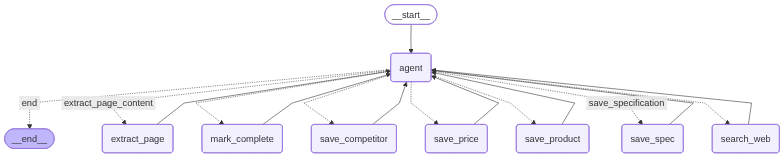

# Competitive Intelligence Database

Agentic (LangGraph) AI that discovers competitors, products, specs, prices, and reviews for pressure transmitters; the LLM chooses tool calls based on current state (competitors/products/specs/prices/reviews) and stops when thresholds are met. Results are written to Neo4j and visualized in Streamlit.

## LangGraph Overview
```
__start__ → agent (LLM) → router → tool nodes → agent (loop) → __end__
Tools: search_web, extract_page_content, save_competitor, save_product,
       save_specification, save_price, save_review, mark_complete
```


## Setup & Run
1) Create and activate env, then install deps:
```
# conda
conda create -n ci_db python=3.11 -y
conda activate ci_db

# OR venv
python -m venv .venv
source .venv/bin/activate   # Windows: .venv\Scripts\activate

pip install -r requirements.txt
```

2) Create `.env` with keys and Neo4j creds:
```
OPENAI_API_KEY=...
TAVILY_API_KEY=...
NEO4J_URI=bolt://localhost:7687
NEO4J_USER=neo4j
NEO4J_PASSWORD=your_password
```

3) Run the agentic pipeline:
```
python -m src.pipeline.graph_builder --mode agentic
```

4) Launch the Streamlit dashboard:
```
streamlit run streamlit_app.py
```

5) Optional quick test:
```
python -m src.pipeline.graph_builder --mode agentic --iterations 10 --competitors 3
```


