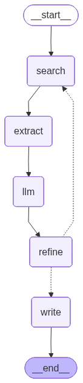

## Competitive Intelligence Graph - Setup and Usage

### Goals
- To build a structured knowledge graph that connects industries, customer segments, needs, and products to help Honeywell analyze its portfolio and competition.
- To build an unstructured database of public sources (e.g., trade articles, product catalogs, reviews) to validate and support insights from the structured data.

### Pipeline Overview

The pipeline uses LangGraph to iteratively extract competitive intelligence data into a knowledge graph:

Current progress


**Pipeline Flow:**
1. **Query Node**: Generates search query
2. **Extract Node**: Fetches content from Tavily API
3. **LLM Node**: Extracts structured data (companies, products, relationships)
4. **Refine Query Node**: Analyzes what's missing and generates next query
5. **Write Node**: Saves final data to Neo4j

Behavior (high-level):
- Processes one Tavily page per iteration.
- LLM extracts data to the schema (Honeywell, competitors, specific products).
- Refine step iterates until limits are met or attempts are exhausted.
- Writes results to Neo4j.
- Knowledge graph can be generated with Neo4j

### Prerequisites
- Python 3.11
- Neo4j (Desktop or Docker)
- Accounts/API keys:
  - OpenAI API key
  - Tavily API key

### 1) Create and activate a Conda environment (recommended)
```bash
conda create -n ci_db python=3.11 -y
conda activate ci_db
```

Alternatively, with venv:
```bash
python3 -m venv .venv
source .venv/bin/activate
```

### 2) Install dependencies
```bash
pip install -r requirements.txt
```

### 3) Configure environment variables
Create a `.env` file in the project root with:
```env
OPENAI_API_KEY=your_openai_key
TAVILY_API_KEY=your_tavily_key

# Neo4j connection
NEO4J_URI=bolt://localhost:7687
NEO4J_USER=neo4j
NEO4J_PASSWORD=your_password

# Optional chunking overrides
# CHUNK_SIZE=3000
# CHUNK_OVERLAP=300
```

### 4) Start Neo4j
- Neo4j Desktop: start a local database and set the password to match `.env`.

Neo4j Browser: `http://localhost:7474`

### 5) Run the pipeline
Run from the project root.
```bash
python -m src.pipeline.graph_builder
```


### 6) View the knowledge graph
Open Neo4j Browser at `http://localhost:7474` and run queries like:
```MATCH (n)-[r]->(m) RETURN n, r, m
```

Reset the database:
```
MATCH (n) DETACH DELETE n;
```

### 7) Optional: Update pipeline visualization

The pipeline graph (`langgraph_pipeline.png`) is included in the repo. To regenerate it:

```bash
python visualize_pipeline.py
```

This saves `langgraph_pipeline.png` to the project root. If PNG generation fails, it prints ASCII or Mermaid diagrams instead.


